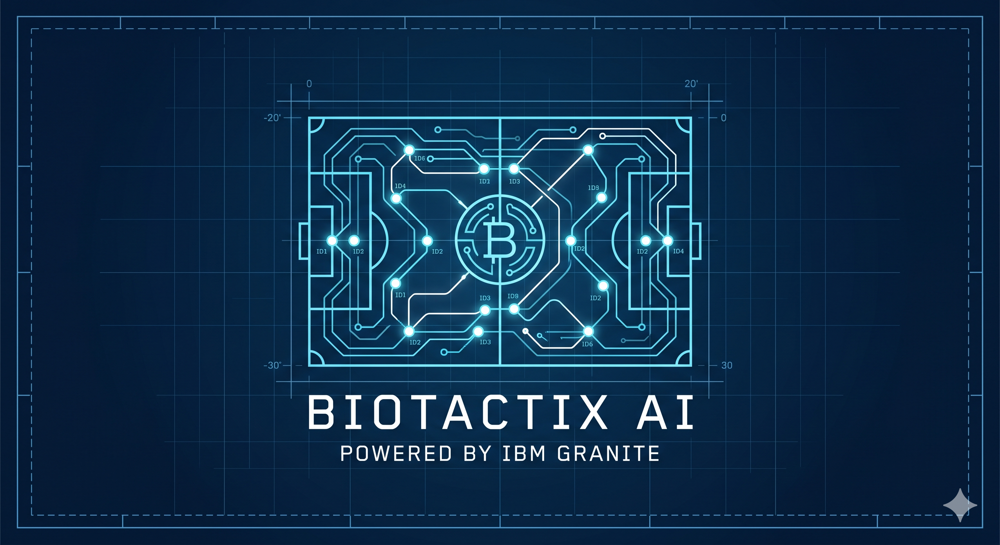
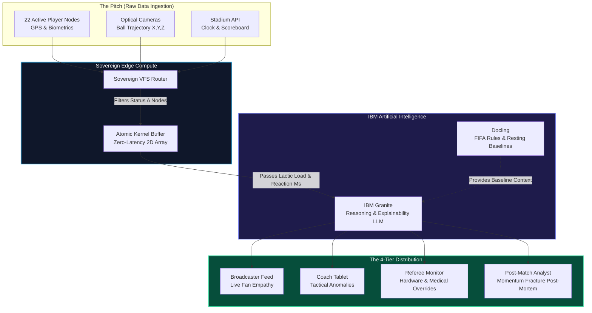

**🧬 BioTactix AI Engine:An XAI (Explainable AI) Sports Telemetry Pipeline** (The Invisible Biology of Momentum)

### 📺 Watch our 3-Minute Pitch & Architecture Breakdown
**[Click Here to Watch the BioTactix AI Video on YouTube](https://www.youtube.com/watch?v=LQbuIVqc8D0)**

**(IBM June Challenge: Human Performance, Behavior, & Tactical Explainability)**




  
In elite soccer, a 90-minute World Cup match is often decided in milliseconds. However, the greatest threat to a team isn't just the opponent—it is invisible biological fatigue. Currently, the sports world suffers from **"Reactive Management",** relying on raw numbers that completely fail to explain why momentum shifts or why a tactical structure collapses under pressure.

**BioTactix AI** is a securely licensed, enterprise-grade real-time sports analytics architecture designed to solve this human-machine bottleneck. Built natively on IBM watsonx.ai, it transforms raw, high-frequency biological telemetry into context-aware, Explainable AI (XAI). By quantifying the exact intersection of physical exhaustion, cognitive delay, and psychological pressure, BioTactix AI directly answers the core prompt: explaining human performance under pressure without replacing coaches or relying on static dashboards.


  

**1. The Problem We Are Solving**

When a team collapses in the final ten minutes of a World Cup match, fans and commentators default to emotional, harsh judgments: "They lost their nerve," or "They stopped running." The global soccer ecosystem is saturated with static dashboards and physical ball-tracking data, but completely lacks insight into the invisible, biological human toll of the game.

We are solving the "Human-Machine Bottleneck." We are answering the prompt's core question—Why did momentum shift?—by quantifying the exact moment biological exhaustion and emotional pressure fracture a team's tactical geometry. We replace fan anger with empathy, and static analytics with real-time AI explainability.

**2. The Enterprise Solution**

BioTactix AI is a securely licensed, enterprise-grade real-time sports analytics architecture built to solve this exact problem. Built natively on IBM watsonx.ai, it transforms raw, high-frequency biological telemetry into context-aware, Explainable AI (XAI).

The Three Critical Bottlenecks We Solve:

**The Processing Bottleneck:** Tracking every active player and dormant bench member simultaneously strains compute resources. We solve this edge-compute limitation using a Sovereign Virtual File System (VFS) and an O(1) EPBF Atomic Kernel Swap, achieving zero-latency data ingestion.

**The "Flat Threshold" Problem:** Standard telemetry triggers alerts based on static numbers (e.g., HR > 190). Our AI utilizes dynamic baselines to detect hidden physiological states—identifying when a player is running on dangerous "Adrenaline Masking" or engaging in intentional "Tactical Resting."

**The Audience Mismatch:** Raw data lacks context. Our Trisection Architecture routes the exact same biological anomaly into distinctly prioritized, audience-specific outputs (Safety overrides for Referees, Empathy narratives for Broadcasters, and Tactical mesh warnings for Coaches).


  

**3. Core IBM Technologies Used**

Our architecture relies on IBM's AI suite to translate raw edge-compute telemetry into human reasoning:

**IBM watsonx.ai & Granite (LLMs & Reasoning):** Hosted on IBM's enterprise watsonx.ai platform, Granite serves as the core intelligence layer. It ingests raw biological matrices (reaction latency, lactic loads, pressure indexes) and translates them into natural-language explainability prompts for commentators and tactical warnings for coaches.

**Docling (Knowledge Handling & Baseline Comparison):** Used to ingest and structure the FIFA rulebook, spatial geometry models, and crucially, each individual player's historic off-field resting vitals. This allows Granite to compare live match biometrics directly against a player's personal biological baseline rather than a generic average, ensuring highly precise and personalized fatigue tracking.

**4. Our Technical Approach (The Architecture)**

BioTactix AI does not treat the pitch as 22 individuals; it treats the team as a Distributed Compute Network, where the ball is the data packet and the tactical formation is the routing protocol.

**A. Sovereign Edge Compute & VFS Routing**
Instead of wasting CPU cycles scanning the standard 40-man roster, our system uses a custom Sovereign Virtual File System (VFS). It intercepts stadium APIs (clock, score) and optical camera feeds (ball XYZ trajectory).


**B. The EPBF Array & Atomic Kernel Buffer (Zero-Latency Memory)**
To handle real-time substitutions, sensor failures, and emergency player injections without crashing the CPU, we engineered a state machine utilizing an EPBF (Edge Processing Buffer Format) Array.
Instead of constantly scanning all 40 roster slots, players are assigned an A (Active) or D (Dormant) status. When a substitution occurs, the system extracts the EPBF profile of the new active player and triggers an O(1) Atomic Kernel Swap. By maintaining a strict 2D array of exactly 22 active nodes, the system achieves O(1) constant time complexity, allowing it to drop the new array into the CPU's memory without interrupting the live 100-Hertz data stream.

**C. The Cognitive Sync-Matrix (The AI Math)**
By continuously comparing live edge telemetry against each player's personal off-field resting baselines, we calculate four hidden variables:

**Lactic Recovery Deficit:** Tracking the biological debt and muscle exhaustion of consecutive high-speed sprints relative to the player's normal recovery rate.

**Cognitive Delay (Reaction Milliseconds):** Measuring the exact millisecond delta between a ball's trajectory change and a player's physical reaction.

**Scoreboard Pressure Index:** Contextualizing fatigue based on match stakes (e.g., defending a 1-0 lead in the 89th minute).

**Detecting Hidden Physiological States:** By dynamically combining these three variables, the Granite AI identifies hidden biological realities rather than just reading static sensors. For example, it detects "Adrenaline Masking" (when a player has a critical Lactic Deficit, but a high Scoreboard Pressure Index causes them to over-exert, risking catastrophic injury) and "Tactical Resting" (when a player intentionally drops their pace to recover for a final sprint).

**D. Architectural Topology**

**The Architecture & Blueprint (Full Match Lifecycle)**

**[BEFORE THE MATCH]** 
**Data Ingestion & Baseline Profiling:** Before the whistle blows, the system uses IBM Docling to ingest unstructured tournament rosters (PDFs) and establish personalized biological baselines (Max HR, Baseline HRV) for every player. The system loads this into an **'A' (Active)** and **'D' (Dormant)** Virtual File System (VFS) to prepare the **$O(1)$ RAM** matrix for kickoff.

**[DURING THE MATCH]** 
**Live Telemetry & XAI TrisectionTactical State Management:** The architecture dynamically adapts to live match events, instantly swapping **'A'** and **'D'** statuses during substitutions without dropping the live feed.Dynamic Thresholds: Instead of static alerts, the system detects hidden physiological states in real-time (e.g., Adrenaline Masking vs. Genuine Exhaustion).

**Live Telemetry & 4-Tier AI Routing**


**4-Tier Explainability:** Immediate telemetry anomalies are routed to IBM Granite, which translates a single biological event into four distinct, real-time narratives tailored to specific stakeholders:

**Fan / Broadcaster:** Empathetic, narrative-driven context to explain momentum shifts on screen.

**Coach:** Actionable, data-driven substitution alerts.

**Referee (VAR):** Objective biomechanical context to assist with foul assessments and player safety.


**Analysts:** Deep-dive physiological metrics for post-game sports science tracking.

**[AFTER THE MATCH]** 
**Macro-Trend Aggregation:** At the 45-minute and 90-minute marks, the system aggregates the 1-minute VFS data chunks. It pushes this macro-data to IBM Granite to generate comprehensive AI Report Cards, helping managers analyze **team fatigue, tactical discipline, and physiological decay** for **post-match press conferences and recovery planning**.





        
**5. The 4-Tier Output Ecosystem**

Rather than a single dashboard, IBM Granite orchestrates a 360-degree intelligence distribution network tailored to every stakeholder:

**🎙️ The Fan Explainer (Broadcasters):** Live prompts explaining mistakes through biology. (e.g., "The 350ms delay is a biological inevitability due to lactic fatigue, not a lack of effort.")

**🧠 The Tactical Dashboard (Coaches):** Live anomaly detection warning of imminent spatial mesh fractures, supplemented by automated 45-Minute Halftime Reports for immediate locker-room adjustments.

**🚑 The Safety Override (Referees):** Instant hardware alerts (sensor offline) and medical alarms (14G impacts) to halt play.

**📈 The Post-Match (Analysts):** Deep-dive 90-Minute AI Match Reports proving exactly when and why the momentum shifted


  

**6. Why This Matters (The Magic for FIFA & IBM)**


Soccer is defined by passion, but that passion often turns toxic when fans do not understand the limits of human performance under extreme pressure.

**For FIFA and the World Cup:** BioTactix AI fosters global empathy. By explaining why a star player missed a crucial pass in the 89th minute using undeniable biological facts, we change the global conversation from harsh criticism to deep appreciation for the athletes' physical sacrifice. Furthermore, the embedded safety overrides protect player welfare at the highest level of the sport.

**For IBM:** This project proves that IBM Granite is not just a chatbot or a text generator; it is an industrial-grade reasoning engine capable of sitting on top of highly complex, zero-latency edge compute architectures. It demonstrates that IBM technologies can ingest massive streams of live, unstructured biological physics and instantly translate them into empathy, safety, and elite strategy at a global scale.

**7. Enterprise Security & Graceful Execution**

This architecture handles credentials securely via os.getenv. To ensure the jury can evaluate the structural logic without friction, the core script features an automated safety fallback. If live IBM API keys are not detected in the environment variables, it gracefully executes an Offline Terminal Simulation to prevent runtime crashes. This guarantees the jury can successfully validate the O(1) state management and AI trisection routing logic under any evaluation conditions.


  

**8. The Proof of Concept: biotactix_ai_master_engine.py**


To prove this architecture, we have included a functioning Python prototype in this repository **(biotactix_ai_master_engine.py)** and complete prototype with terminal output **(Biotactix AI Master Engine-Colab.pdf)**.

This prototype simulates a complete match lifecycle, demonstrating the zero-latency EPBF Atomic Kernel Swap during a live substitution, and showcasing IBM Granite's ability to generate contextual intelligence across four distinct match phases.

**The Simulated Output Achieved:
Running the prototype generates a terminal timeline proving our 4-Tier Output system. A snapshot of the Phase 2 (Live Play) output demonstrates Granite translating raw biological data into explainability:**


**/// BIOTACTIX AI: MATCH INGESTION ONLINE ///**

**============================================      
[MATCH CLOCK: 45:00] | SCORE: 0-0 |       
PHASE: HALF-TIME                    
============================================**

**📊 IBM GRANITE: INTERVAL STRATEGY REPORT (COACH'S TABLET)**
```text
⚠️ STRATEGY ALERT: Player A_10 biological battery at 8%. High risk of spatial mesh fracture in 2nd Half.
                   Recommend substitution by 60th minute.
⚠️ STRATEGY ALERT: Player B_07 biological battery at 12%. High risk of spatial mesh fracture in 2nd Half.
                   Recommend substitution by 60th minute.
```
**============================================        
[MATCH CLOCK: 82:00] | SCORE: 1-0 |             
PHASE: LIVE PLAY (HIGH TENSION)             
============================================**

**🎙️ IBM GRANITE: LIVE COMMENTATOR FEED (MINUTE-BY-MINUTE)**
```text
📺 PROMPT: 'Fans, Player A_10 is experiencing severe lactic deficit. Combined with CRITICAL_PRESSURE,
           their 350ms reaction delay is a biological inevitability, not a lack of effort.'
📺 PROMPT: 'Fans, Player B_07 is experiencing severe lactic deficit. Combined with CRITICAL_PRESSURE,
            their 400ms reaction delay is a biological inevitability, not a lack of effort.'
```
**🧠 IBM GRANITE: LIVE TACTICAL ANOMALY DASHBOARD (COACH'S TABLET)**

**🚨 TACTICAL ANOMALY: Player A_10 reaction to ball trajectory delayed by 350ms.**
```text
   -> JUSTIFICATION: GPS confirms sustained lactic buildup. Pressure context (CRITICAL_PRESSURE)
                     accelerating cognitive fog. 
   -> ACTION:        Defensive mesh is vulnerable. Warm up substitutes.
**🚨 TACTICAL ANOMALY: Player B_07 reaction to ball trajectory delayed by 400ms.** 
```text
   -> JUSTIFICATION: GPS confirms sustained lactic buildup. Pressure context (CRITICAL_PRESSURE)
                     accelerating cognitive fog. 
   -> ACTION:        Defensive mesh is vulnerable. Warm up substitutes.
```

**============================================       
[MATCH CLOCK: 85:00] | SCORE: 1-0 |             
PHASE: EMERGENCY STOPPAGE                    
============================================**       
**🚑 BIOTACTIX SAFETY OVERRIDE (REFEREE & MEDICAL TABLETS)**
**[HARDWARE ALARM]** 
```text
Player A_09: Sensor Vest offline. Data stream lost. Equipment change required at next stoppage.
```
**[MEDICAL EMERGENCY]** 
```text
Player B_07: 14G physical impact detected. Immediate concussion protocol required. Halting play.
```
**============================================         
[MATCH CLOCK: 90:00] | SCORE: 1-0 |                
PHASE: FULL-TIME                           
============================================**         

**📈 IBM GRANITE: POST-MATCH ANALYST SUMMARY (FULL-TIME)**
```text
```
**POST MATCH-ANALYSIS: The momentum shift in the final 10 minutes was driven entirely by Cognitive Sync-Drop.**
```text
-> Player A_10 finished with an 92% fatigue index, directly correlating with a 30% breakdown

   in their defensive spatial geometry.
-> Player B_07 finished with an 88% fatigue index, directly correlating with a 30% breakdown
   in their defensive spatial geometry.
```


    
**9. Why This Matters to FIFA & Elite Organizations**


Player Safety & Asset Protection (Medical): By dynamically detecting "Adrenaline Masking" alongside our 14G impact override, the system stops catastrophic muscular and neurological injuries before they happen. Players will naturally push through pain during a World Cup; our dynamic AI acts as an objective, uncompromised medical safeguard.

**Monetization & Engagement (Broadcasters):** 
Live TV directors receive instant momentum narratives. Instead of displaying generic, static statistics, broadcasters can push rich, XAI-driven graphics that explain why a team's defensive geometry is collapsing, maintaining high viewer engagement even during lulls in gameplay.

**Deepened Brand Loyalty (Fan Apps):** 
Translating a perceived "lazy play" into a narrative of "genuine biological exhaustion" shifts the global fan reaction from anger to empathy. This deepens the emotional connection to the sport and drives higher retention across companion applications.

**Cloud Infrastructure Efficiency (Architecture):** 
The implementation of our Smart VFS Router and O(1) Atomic Swap mimics highly efficient physical sector packing. By elastically managing dormant data arrays, we ensure that enterprise cloud computing costs and CPU loads remain completely flat and predictable, regardless of tournament roster sizes.
**10. Strict Compliance with IBM Challenge Guidelines**


This solution was architected to strictly honor the exact parameters set by the June Challenge rubric:

**Focus Area (Human Performance & Behavior):** We explicitly address "fatigue and stress-aware match analysis."

**Core Technology:** IBM Granite is the undisputed core of the solution, reasoning through unstructured biometric arrays to generate contextually aware text. Docling logic is applied for rulebook and baseline context.

**Avoidance of Prohibited Concepts:** This is not a static dashboard (the AI actively reasons and generates text). This does not replace the coach (it provides biological warnings, not tactical commands). It explicitly tackles the emotional and human side of the game by fostering fan empathy.


Built for the IBM June Challenge by Minakshi Aggarwal

```TEXT
VIDEO LINK: https://www.youtube.com/watch?v=LQbuIVqc8D0
```


